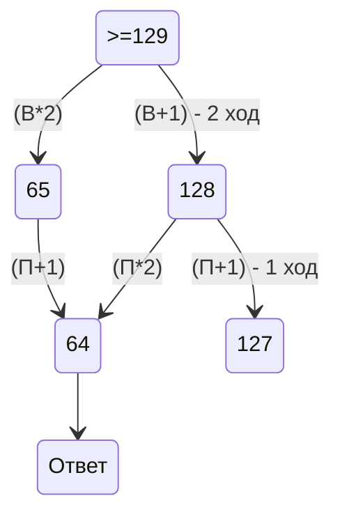
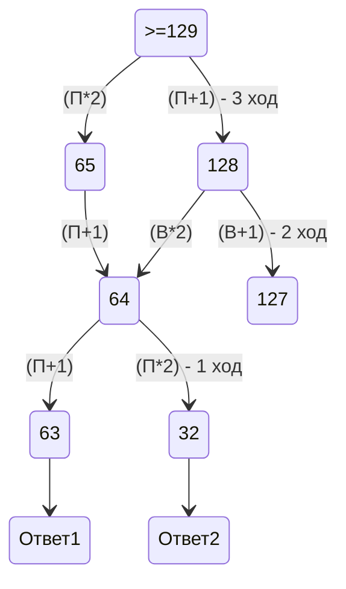
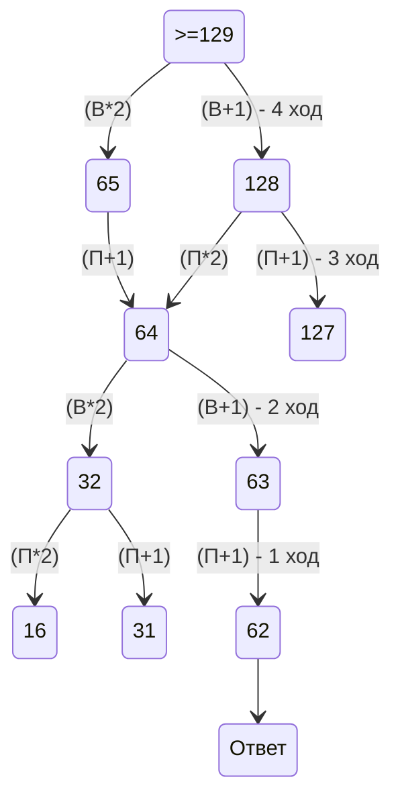

 # 1 задача
1) найти точки, через который проходят пути между пунктами
2) найти все возможные варианты путей и посчитать их сумму
3) сложить ответы
 # 2 
 1 шаг: Получить все возможные варианты по 4-ем переменным
   
 2 шаг: Проверяем функцию через pynton и выводим ответ
 # 19 

 # 20

 # 21

  
